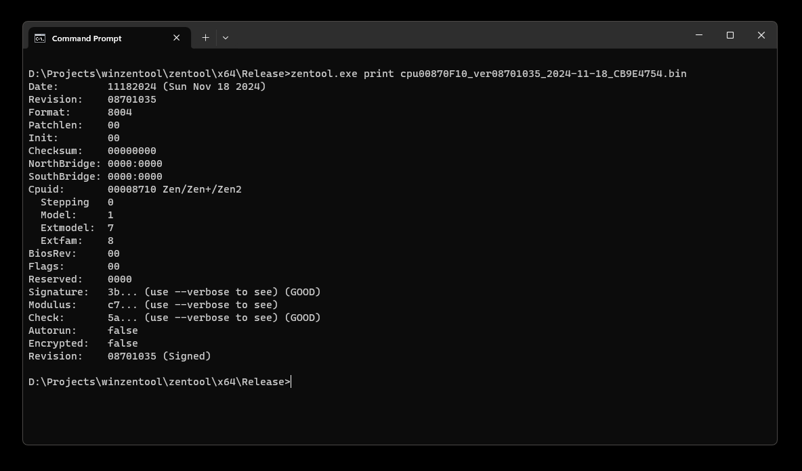

# winzentool
A quick and dirty port of [zentool](https://github.com/google/security-research/tree/master/pocs/cpus/entrysign/zentool) to Microsoft Windows.



## Changes made
- Used [getopt-for-windows](https://github.com/Chunde/getopt-for-windows) to keep command-line parsing as-is.
- Implemented non-standard functions such as `errx()` and `strlcat()`.
- Rewrote the majority of structures in `ucode.h` so that they correctly map to the data when compiling with MSVC.
- Hardcoded offsets and sizes because the `bitoffsetof()` and `bitsizeof()` macros do not work under MSVC.
- Rewrote the microcode loader (`loader.c`) to use a kernel-mode driver instead of Linux's `/dev/cpu/` and its `mmap()` functionality.
- Added `test` command to print current microcode revision and `fpatan` return value of each CPU.

## Compiling

1. **Install Visual Studio 2022 and vcpkg:**  
   Download and install [Visual Studio 2022](https://visualstudio.microsoft.com/) with the **Desktop development with C++** workload. Also, set up [vcpkg](https://github.com/microsoft/vcpkg) for dependency management.

2. **Install Dependencies:**  
   Open your terminal and run the following commands:
   ```
   vcpkg install json-c
   vcpkg install openssl
   vcpkg install gmp
   ```
3. **Compile the Solution:**  
   Open and compile the solution file (`zentool.sln`).

4. **Locate the Binaries:**  
   After compilation, you'll find `zentool.exe`, `mcop.exe`, `mcas.exe`, and the required dependencies in the `\zentool\x64\Release` folder.

## Microcode loading
You can use the tool to load the modified firmware just as you would on Linux, but you need to load a kernel-mode driver.

I have decided to "borrow" a driver from ASRock because it is code-signed (meaning you don't need to enable test signing mode) and is not blocked (at least for now) by the vulnerable driver blocklist.

You can [download the driver from here](https://www.loldrivers.io/drivers/3f39af20-802a-4909-a5de-7f6fe7aab350/).

Once downloaded, load it as follows:

```
sc create AsrOmgDrv binPath="C:\path\to\AsrOmgDrv.sys" type=kernel
sc start AsrOmgDrv
```

Then, you can use the load command:

```
zentool.exe --debug load --cpu 2 update.bin
```

## License
Most of the files originate from [zentool](https://github.com/google/security-research/tree/master/pocs/cpus/entrysign/zentool) and retain their original [Apache License, Version 2.0](http://www.apache.org/licenses/LICENSE-2.0). Some files may have different licenses; for example, `win_getopt.c` and `win_getopt.h` are released under the [LGPL](https://www.gnu.org/licenses/old-licenses/lgpl-2.1.en.html). Please check each file header for more details.
